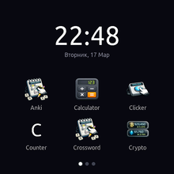
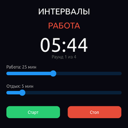
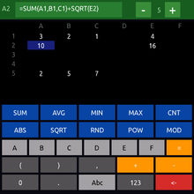
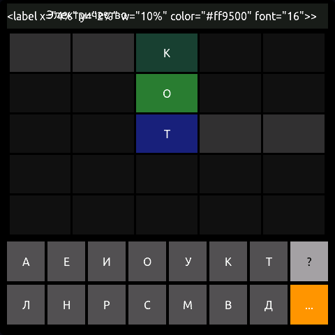
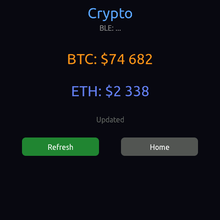
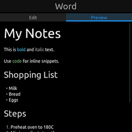

# TelaOS

# TelaOS

**TelaOS (Tela — canvas in Latin) — blank canvas OS for low-memory smart devices (ESP32 and more). Paint apps. Yours. With AI. Or yourself.**

Smartwatch OS where apps are just HTML + Lua scripting. Write a complete app in a single `.bax` file — declarative UI, reactive state, embedded logic — and it runs natively on ESP32 with LVGL rendering.

**Development tools:**
- 📱 **[TelaPhone](https://github.com/OpenTela/TelaPhone)** — Android companion with AI-powered code generation
- 💻 **[TelaIDE](https://github.com/OpenTela/TelaIDE)** — Desktop IDE with real-time emulator

[](docs/screens/launcher.png)
[](docs/screens/pomodoro.png)
[](docs/screens/excel.png)
[](docs/screens/crossword.png)
[](docs/screens/crypto.png)
[](docs/screens/markdown.png)

**Application example:**
```xml
<app>
  <ui default="/main">
    <page id="main">
      <label align="center" y="30%" color="#fff" font="72">{count}</label>
      <button align="center" y="55%" w="60%" h="50" bgcolor="#3498db" onclick="add">+1</button>
    </page>
  </ui>

  <state>
    <int name="count" default="0"/>
  </state>

  <script language="lua">
    function add()
      state.count = state.count + 1
    end
  </script>
</app>
```

That's a working app. Deploy it over BLE, it appears in the launcher with an icon.

<!-- TODO: add screenshot/gif of launcher and running app -->

---

## What's inside

**27 apps** included, all as single `.bax` files (HTML + Lua — and yes, one runs on Brainfuck):

- **Calculator** — standard calc with expression parsing
- **Excel** — spreadsheet with formulas and cell navigation
- **Weather** — live weather via BLE bridge API
- **Crypto** — real-time cryptocurrency tracker
- **Snake** — canvas rendering, touch-directed movement
- **Pomodoro** — multi-page timer with configurable intervals
- **Paint** — freehand drawing on canvas with color picker
- **Crossword / Scanword** — word puzzles with keyboard input
- **Anki** — flashcard learning system
- **Arkanoid, Pong, Dino, 2048, Memory** — classic games

Production apps ship with the firmware in `data/apps/`. The rest live in `experiments/` as starting points to build on.

**The stack:**

```
  .bax app (HTML + CSS + Lua)
         ↓
  Preprocessor ── templates, @for loops, multi-pass expansion
         ↓
  UI Engine ── parses markup, builds widget tree
  State    ── reactive bindings, two-way sync
  Lua VM   ── sandboxed scripts, timers, canvas API
  CSS      ── tag/class/id selectors, cascade
         ↓
  LVGL 9.2 ── native rendering, 60fps
         ↓
  ESP32-S3 ── 240MHz, 8MB PSRAM, 480×480 touch display
```

The launcher shows apps as a grid of icons across swipeable pages. A shade panel (swipe down) provides quick access to brightness, BLE status, and battery. Apps launch instantly and return to the launcher with the hardware button or `exit()` from Lua.

## Hardware

Runs on ESP32 boards with LVGL-compatible displays:

| Board | Display | Touch | Status |
|-------|---------|-------|--------|
| ESP-4848S040 | 480×480 RGB, ST7701 | GT911 | Primary |
| ESP-8048W550 | 800×480 RGB | GT911 | Supported |
| T-Watch 2020 | 240×240 SPI | FT6336 | Supported |

Adding a new board = one HAL file (~100 lines). Display, touch, backlight, buttons.

## App format

A `.bax` file is self-contained — UI, state, logic, styles:

```xml
<app>
  <config>
    <network/>              <!-- optional: internet via BLE bridge -->
  </config>

  <templates>
    <template id="MyButton">
      <td><button class="{cls}" onclick="{click}">{label}</button></td>
    </template>
  </templates>

  <ui default="/main">
    <group id="main" orientation="horizontal" indicator="dots">
      <page id="home">
        <!-- Usage: -->
        <table x="5%" y="80%" w="90%" h="40">
          <tr>
            <MyButton cls="primary" click="save" label="Save"/>
            <MyButton cls="danger" click="reset" label="Reset"/>
          </tr>
        </table>
      </page>
      <page id="settings">...</page>
    </group>
  </ui>

  <state>
    <string name="city" default="Moscow"/>
    <int name="temp" default="0"/>
    <bool name="loading" default="false"/>
  </state>

  <timer interval="1000" call="tick"/>

  <script language="lua">
    function tick()
      -- your logic here
    end
  </script>

  <style>
    button { bgcolor: #333; radius: 8; }
    .primary { bgcolor: #0066ff; color: #fff; }
  </style>
</app>
```

### Widgets

`label`, `button`, `slider`, `switch`, `input`, `canvas`, `image`, `table`/`tr`/`td` — with positioning (`x`, `y`, `w`, `h` in px or %), alignment (`align="center center"`), colors, fonts (16/32/48/72px).

### Templates & Loops

Reusable components and compile-time code generation:

```xml
<templates>
  <template id="Cell">
    <td><button id="{col}{row}" onclick="tap('{col}{row}')">{v{col}{row}}</button></td>
  </template>
</templates>

<!-- Generates 8×6 = 48 cells from 3 lines -->
@for(r in 1..8) {
  <tr>
    @for(c in 0..5) {
      <Cell col="{c}" row="{r}"/>
    }
  </tr>
}
```

Templates nest, support attribute substitution, and expand in multiple passes.

### Bindings

Reactive — change `state.count` and every `{count}` in the UI updates automatically. Works in text content, `bgcolor`, `color`, `visible`, and `class` attributes.

```xml
<label color="{statusColor}">{statusText}</label>
<button class="{btnClass}" onclick="toggle">{btnLabel}</button>
<label visible="{isLoading}">Loading...</label>
```

### Lua API

```lua
state.varName = "value"          -- reactive state
navigate("/settings")            -- page navigation
focus("inputId")                 -- keyboard focus
setAttr("btn1", "bgcolor", "#f00")  -- imperative styling
canvas.rect("c", 10, 10, 50, 50, "#ff0000")  -- 2D drawing

-- onclick with arguments (from templates)
-- <button onclick="tap('A1')"> → calls tap('A1') directly
function tap(id)
  state.selected = id
end

fetch({url="https://...", authorize=true, format="json"}, function(r)
  -- r.body is already a Lua table when format="json"
  -- authorize=true: BLE bridge adds API credentials
end)
```

### CSS

Tag, class, compound, and ID selectors with specificity cascade:

```css
button { bgcolor: #333; radius: 8; }        /* tag */
.primary { bgcolor: #06f; color: #fff; }    /* class */
button.danger { bgcolor: #e74c3c; }         /* tag.class */
#header { font: 48; }                       /* id */
```

## Connectivity

Apps access the internet through a BLE bridge — a companion Bluetooth app on your phone or a Python script on PC proxies HTTP requests. API keys are stored on the bridge side, not on the device — `authorize = true` tells the bridge to inject credentials from its config. One key serves all apps, and the watch never stores secrets.

```lua
fetch({
  url = "https://api.openweathermap.org/data/2.5/weather?q=Moscow",
  authorize = true,
  format = "json",
  fields = {"main.temp", "weather[0].description"}
}, function(r)
  if r.ok then
    state.temp = math.floor(r.body["main.temp"]) .. "°C"
  end
end)
```

The bridge also enables remote control — deploy apps, take screenshots, simulate touch, manage state — all over BLE or Serial with a unified command protocol.

## Build & deploy

```bash
pio run                    # build firmware
pio run -t upload          # flash firmware
pio run -t uploadfs        # flash apps to LittleFS
```

Deploy individual apps over BLE without reflashing:

```bash
python tools/ble_assistant.py
assistant> app push myapp
```

## Project structure

```
src/
├── core/           # app manager, state store, script engine
├── ui/             # HTML parser, CSS parser, widget builder, launcher, BaxApp
├── engines/lua/    # Lua VM, timers, fetch, canvas bindings
├── console/        # command protocol (Serial + BLE transport)
├── ble/            # BLE bridge, binary transfer
├── hal/            # hardware abstraction (per-board drivers)
├── widgets/        # LVGL widget wrappers
├── native/         # native C++ apps
├── csv/            # CSV parser
├── yaml/           # YAML parser/serializer
└── utils/          # logging, fonts, screenshots

data/apps/          # production apps (ship with firmware)
experiments/        # experimental apps (starting points)
docs/               # specs & guides
tools/              # BLE assistant (Python)
scripts/            # build scripts (icons, resources)
```

~18K lines of C++. ~24K with apps.

## Memory architecture

LVGL objects live in PSRAM (8MB). DRAM is reserved for fast draw operations (adaptive allocator with pressure detection). Display buffer auto-sizes based on app complexity — shrinks for heavy apps like Excel, restores for simple ones.

```
DRAM (320KB total)
  ├── draw temps, masks (<512B allocs, adaptive threshold)
  ├── display buffer (28-112KB, auto-sized per app)
  └── BLE stack (~40KB when active)

PSRAM (8MB)
  ├── LVGL objects, styles, text
  ├── app parsing buffers
  └── screenshot buffer
```

App state is owned by `BaxApp` — a single RAII object. Switching apps destroys the old one (all LVGL widgets, vectors, strings freed automatically via destructor), then constructs a fresh one. No manual `.clear()` lists.

## Examples

<details>
<summary><b>Dice</b> — minimal app (20 lines)</summary>

```xml
<app>
  <ui default="/main">
    <page id="main" bgcolor="#1a1a2e">
      <label align="center" y="8%" color="#fff" font="24">DICE</label>
      <label align="center" y="40%" color="#f1c40f" font="72">{result}</label>
      <button align="center" y="70%" w="70%" h="60" bgcolor="#e74c3c" onclick="roll">ROLL</button>
    </page>
  </ui>
  <state>
    <string name="result" default="?"/>
  </state>
  <script language="lua">
    function roll()
      state.result = tostring(math.random(1, 6))
    end
  </script>
</app>
```
</details>

<details>
<summary><b>Calculator</b> — templates, table layout, CSS</summary>

```xml
<app>
  <templates>
    <template id="Num">
      <td><button class="btn btn-num" onclick="appendDigit('{n}')">{n}</button></td>
    </template>
    <template id="Func">
      <td><button class="btn btn-func" onclick="{click}">{label}</button></td>
    </template>
    <template id="Op">
      <td><button class="btn" onclick="{click}" bgcolor="{bg}" color="#fff">{label}</button></td>
    </template>
  </templates>

  <ui default="/calc">
    <page id="calc" bgcolor="#000">
      <label class="display" align="right" x="12%" y="7%" w="76%" h="10%">{display}</label>

      <table x="4%" y="20%" w="92%" h="75%" cellspacing="2%">
        <tr>
          <Func click="clear" label="C"/>
          <Func click="negate" label="+/-"/>
          <Func click="percent" label="%"/>
          <Op click="opDiv" bg="{bgDiv}" label="/"/>
        </tr>
        <tr>
          <Num n="7"/>  <Num n="8"/>  <Num n="9"/>
          <Op click="opMul" bg="{bgMul}" label="x"/>
        </tr>
        <tr>
          <Num n="4"/>  <Num n="5"/>  <Num n="6"/>
          <Op click="opSub" bg="{bgSub}" label="-"/>
        </tr>
        <tr>
          <Num n="1"/>  <Num n="2"/>  <Num n="3"/>
          <Op click="opAdd" bg="{bgAdd}" label="+"/>
        </tr>
        <tr>
          <Func click="backspace" label="DEL"/>
          <Num n="0"/>
          <td><button class="btn btn-num" onclick="dot">.</button></td>
          <td><button class="btn btn-eq" onclick="equals">=</button></td>
        </tr>
      </table>
    </page>
  </ui>

  <state>
    <string name="display" default="0"/>
    <string name="op" default=""/>
    <float name="prev" default="0"/>
    <bool name="newInput" default="true"/>
    <string name="bgAdd" default="#ff9500"/>
    <string name="bgSub" default="#ff9500"/>
    <string name="bgMul" default="#ff9500"/>
    <string name="bgDiv" default="#ff9500"/>
  </state>

  <script language="lua">
    local OP_NORMAL = "#ff9500"
    local OP_ACTIVE = "#ffc966"

    local function resetOpBtns()
      state.bgAdd = OP_NORMAL; state.bgSub = OP_NORMAL
      state.bgMul = OP_NORMAL; state.bgDiv = OP_NORMAL
    end

    function appendDigit(d)
      if state.newInput then
        state.display = d; state.newInput = false; resetOpBtns()
      else
        state.display = (state.display == '0') and d or (state.display .. d)
      end
    end

    function dot()
      if state.newInput then
        state.display = '0.'; state.newInput = false; resetOpBtns()
      elseif not string.find(state.display, '%.') then
        state.display = state.display .. '.'
      end
    end

    function clear()
      state.display = '0'; state.op = ''; state.prev = 0
      state.newInput = true; resetOpBtns()
    end

    function backspace()
      state.display = #state.display > 1
        and string.sub(state.display, 1, -2) or '0'
    end

    function negate()
      state.display = tostring(-(tonumber(state.display) or 0))
    end

    function percent()
      state.display = tostring((tonumber(state.display) or 0) / 100)
    end

    function setOp(newOp, bgVar)
      if state.op ~= '' and not state.newInput then equals() end
      state.prev = tonumber(state.display) or 0
      state.op = newOp; state.newInput = true
      resetOpBtns(); state[bgVar] = OP_ACTIVE
    end

    function opAdd() setOp('+', 'bgAdd') end
    function opSub() setOp('-', 'bgSub') end
    function opMul() setOp('*', 'bgMul') end
    function opDiv() setOp('/', 'bgDiv') end

    function equals()
      local a, b = state.prev, tonumber(state.display) or 0
      local r = b
      if state.op == '+' then r = a + b
      elseif state.op == '-' then r = a - b
      elseif state.op == '*' then r = a * b
      elseif state.op == '/' then
        if b == 0 then state.display = 'Err'; state.op = ''; return end
        r = a / b
      end
      state.display = (r == math.floor(r))
        and tostring(math.floor(r)) or string.format('%.6g', r)
      state.op = ''; state.newInput = true; resetOpBtns()
    end
  </script>

  <style>
    button { width: 100%; height: 100%; }
    .display { background: #1c1c1c; color: #fff; font-size: 32; border-radius: 8; }
    .btn { border-radius: 12px; }
    .btn-num { background: #505050; color: #fff; }
    .btn-func { background: #a0a0a0; color: #000; }
    .btn-eq { background: #ff9500; color: #fff; }
  </style>
</app>
```
</details>

<details>
<summary><b>Weather</b> — internet via BLE bridge, JSON parsing</summary>

```xml
<app>
  <config>
    <network/>
  </config>

  <ui default="/main">
    <page id="main">
      <label align="center" y="10%" color="#fff" font="48">{city}</label>
      <label align="center" y="30%" color="#fff" font="72">{temp}</label>
      <label align="center" y="50%" color="#888">{description}</label>
      <label visible="{isLoading}" align="center" y="70%" color="#ff0">Loading...</label>
      <button align="center" y="80%" w="50%" h="40" bgcolor="#06f" onclick="refresh">
        Refresh
      </button>
    </page>
  </ui>

  <state>
    <string name="city" default="Moscow"/>
    <string name="temp" default="--"/>
    <string name="description" default=""/>
    <string name="isLoading" default="false"/>
  </state>

  <script language="lua">
    function refresh()
      state.isLoading = "true"
      fetch({
        url = "https://api.openweathermap.org/data/2.5/weather?q=" .. state.city,
        authorize = true, format = "json",
        fields = {"main.temp", "weather[0].description"}
      }, function(r)
        state.isLoading = "false"
        if r.ok then
          state.temp = math.floor(r.body["main.temp"]) .. "°C"
          state.description = r.body["weather[0].description"]
        end
      end)
    end

    refresh()
  </script>
</app>
```
</details>

## Documentation

The `docs/` folder contains the core specs:

| File | Description |
|------|-------------|
| [UI_HTML_SPEC.md](docs/UI_HTML_SPEC.md) | Full widget/state/binding/Lua API reference |
| [CONSOLE_PROTOCOL_SPEC.md](docs/CONSOLE_PROTOCOL_SPEC.md) | BLE & Serial command protocol |
| [NATIVE_APP_SPEC.md](docs/NATIVE_APP_SPEC.md) | Native app architecture & integration |
| [BUILD_ICONS.md](docs/BUILD_ICONS.md) | Icon pipeline & embedding |
| [RULE_VERSIONING.md](docs/RULE_VERSIONING.md) | Compatibility & versioning model |
| [CI_README.md](docs/CI_README.md) | Build system & automated OS testing details |

## License

GNU Lesser General Public License [LGPL](LICENSE)
